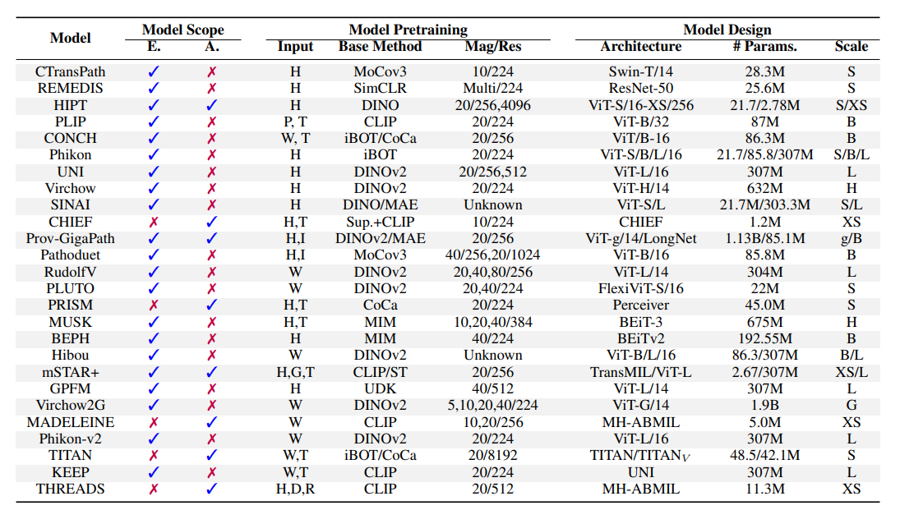

</h1>

    <h1>Awesome Open PathoFoundation</h1>

 收集和梳理病理AI大模型相关 

  
  
  

本项目旨在收集和梳理计算病理学中病理基础模型（PFMs）及大型视觉-语言模型（LVLMs）等相关的开源模型、应用、数据集及教程等资料！

如果本项目能给您带来一点点帮助，麻烦点个⭐️吧～同时也欢迎大家贡献本项目未收录的开源模型、应用、数据集等。

常见底座模型细节概览：
| 底座     | 包含模型                    | 模型参数大小      | 训练token数  | 训练最大长度 | 是否可商用 |
|----------|---------------------------|-----------------|-------------|------------|-------   |
| ChatGLM  | ChatGLM/2/3/4 Base&Chat   | 6B              | 1T/1.4      | 2K/32K     | 可商用   |
| LLaMA    | LLaMA/2/3 Base&Chat       | 7B/8B/13B/33B/70B | 1T/2T       | 2k/4k      | 部分可商用  |
| Baichuan | Baichuan/2 Base&Chat      | 7B/13B          | 1.2T/1.4T | 4k     | 可商用   |
| Qwen     | Qwen/1.5/2/2.5 Base&Chat&VL   | 7B/14B/32B/72B/110B | 2.2T/3T/18T      | 8k/32k     | 可商用   |
| InternLM | InternLM/2/2.5 Base/Chat/VL   | 7B/20B          | -         | 200k | 可商用 |
| DeepSeek | Base&Chat                 | 1.3B/7B/33B/67B | -         | 4k | 可商用 |

## 目录

- [目录](#目录)
  - [1. 模型](#1-模型)
    - [1.1 视觉模型](#11-视觉模型)
    - [1.2 多模态模型](#12-多模态模型)
  - [2. 应用](#2-应用)
    - [2.1 医疗垂直领域微调](#21-医疗垂直领域微调)
  - [3. 数据集](#3-数据集)
    - [预训练数据集](#预训练数据集)
    - [SFT数据集](#sft数据集)

### 1. 模型

#### 1.1 视觉模型

* ChatGLM：
  * 地址：https://github.com/THUDM/ChatGLM-6B
    
  * 简介：中文领域效果最好的开源底座模型之一，针对中文问答和对话进行了优化。经过约 1T 标识符的中英双语训练，辅以监督微调、反馈自助、人类反馈强化学习等技术的加持

#### 1.2 多模态模型

* VisualGLM-6B
  
  * 地址：https://github.com/THUDM/VisualGLM-6B
    
  * 简介：一个开源的，支持图像、中文和英文的多模态对话语言模型，语言模型基于 ChatGLM-6B，具有 62 亿参数；图像部分通过训练 BLIP2-Qformer 构建起视觉模型与语言模型的桥梁，整体模型共78亿参数。依靠来自于 CogView 数据集的30M高质量中文图文对，与300M经过筛选的英文图文对进行预训练。

### 2. 应用

#### 2.1 医疗垂直领域微调

* XrayGLM，首个会看胸部X光片的中文多模态医学大模型：
  
  * 地址：https://github.com/WangRongsheng/XrayGLM
    
  * 简介：该项目为促进中文领域医学多模态大模型的研究发展，发布了XrayGLM数据集及模型，其在医学影像诊断和多轮交互对话上显示出了非凡的潜力。

* MedicalGPT
  
  * 地址：https://github.com/shibing624/MedicalGPT
    
  * 简介：训练医疗大模型，实现包括二次预训练、有监督微调、奖励建模、强化学习训练。发布中文医疗LoRA模型shibing624/ziya-llama-13b-medical-lora，基于Ziya-LLaMA-13B-v1模型，SFT微调了一版医疗模型，医疗问答效果有提升，发布微调后的LoRA权重。

* CareGPT
  
  * 地址：https://github.com/WangRongsheng/CareGPT
    
  * 简介：该项目开源了数十个公开可用的医疗微调数据集和开放可用的医疗大语言模型，包含LLM的训练、测评、部署等以促进医疗LLM快速发展。

* DISC-MedLLM
  
  * 地址：https://github.com/FudanDISC/DISC-MedLLM
    
  * 简介：该项目是由复旦大学发布的针对医疗健康对话式场景而设计的医疗领域大模型与数据集，该模型由DISC-Med-SFT数据集基于Baichuan-13B-Base指令微调得到。

* WiNGPT
  
  * 地址：https://github.com/winninghealth/WiNGPT2
    
  * 简介：WiNGPT是一个基于GPT的医疗垂直领域大模型，基于Qwen-7b1作为基础预训练模型，在此技术上进行了继续预训练，指令微调等，该项目具体开源了WiNGPT2-7B-Base与WiNGPT2-7B-Chat模型。

### 3. 数据集

#### 预训练数据集

#### SFT数据集

* Chinese medical dialogue data：
  
  * 地址：https://github.com/Toyhom/Chinese-medical-dialogue-data
    
  * 数据集说明：中文医疗对话数据集，包括：<Andriatria_男科> 94596个问答对 <IM_内科> 220606个问答对 <OAGD_妇产科> 183751个问答对 <Oncology_肿瘤科> 75553个问答对 <Pediatric_儿科> 101602个问答对 <Surgical_外科> 115991个问答对 总计 792099个问答对。